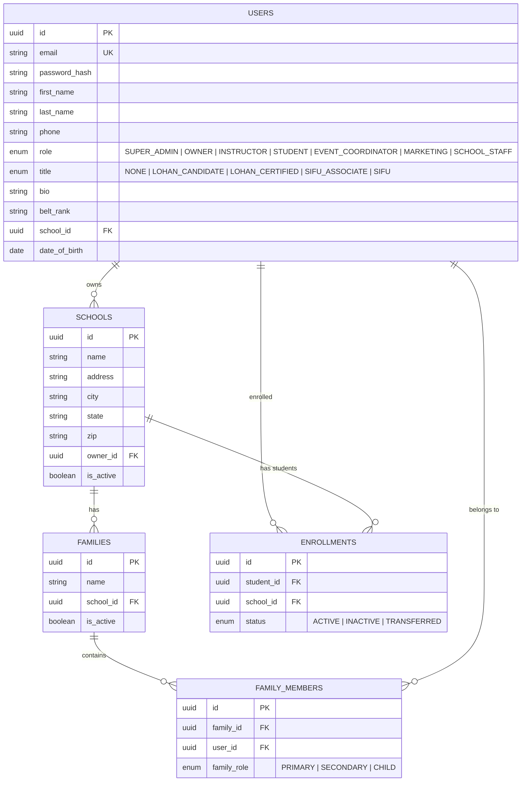
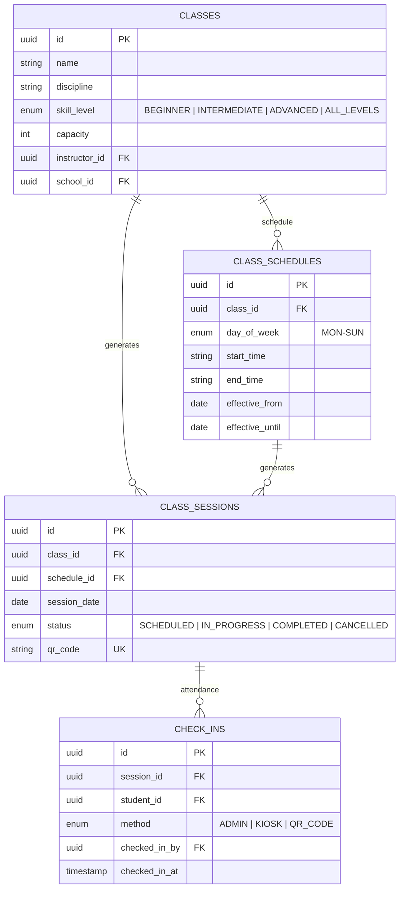
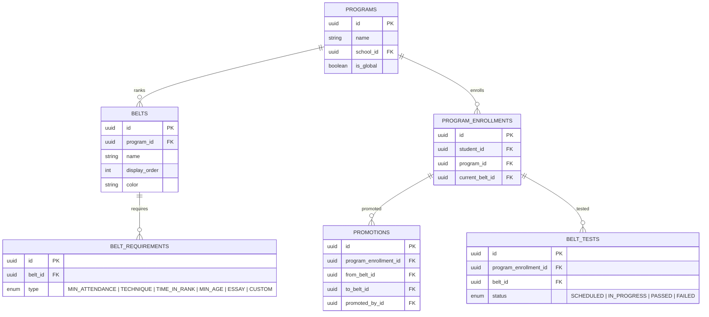
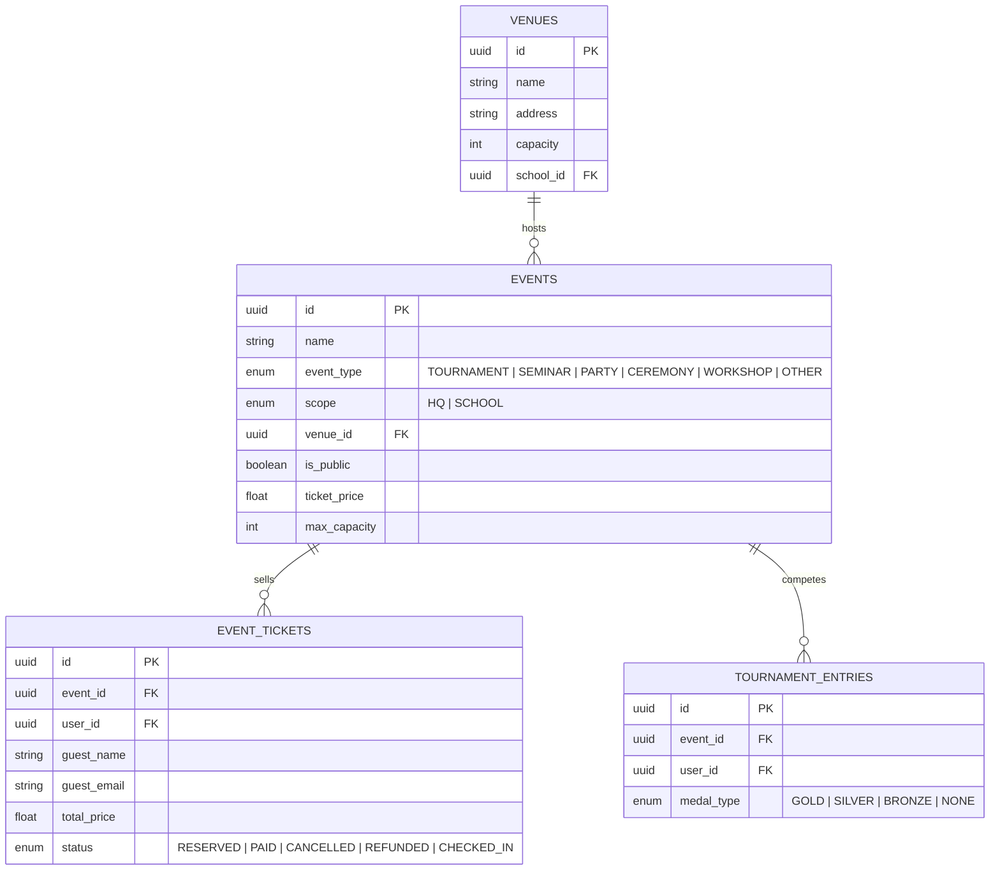
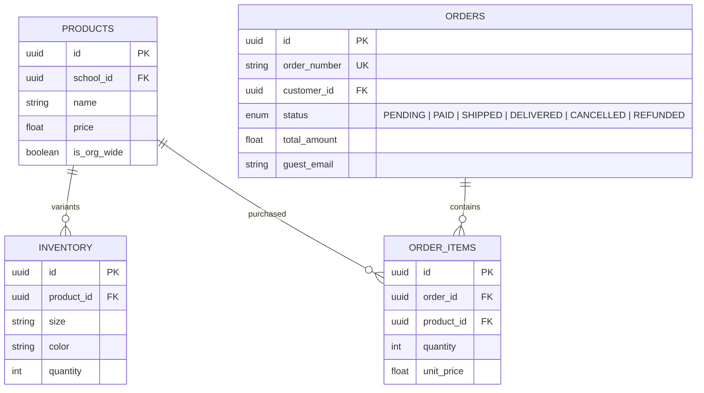
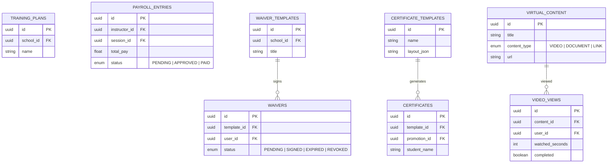

# FlowApp2 Database Schema

> **Last updated:** 2026-02-15 — Penultimate UX Overhaul  
> **Engine:** PostgreSQL 16 · **ORM:** Prisma 5.22  
> **Models:** 52 · **Enums:** 28

---

## Entity Relationship Diagrams

The schema is divided into domain groups for readability.

---

### Core — Users, Schools, Families



#### USERS
All system users share one table. `role` drives RBAC. `title` tracks martial arts titles (Lohan/Sifu) independently of system roles.

#### SCHOOLS
Martial arts schools. Each owned by one OWNER user. Soft-deletable via `isActive`.

#### FAMILIES
Groups related users (parent + children) within a school.

#### ENROLLMENTS
Unique constraint `[studentId, schoolId, status]` prevents duplicate active enrollments.

---

### Scheduling — Classes, Sessions, Check-Ins



---

### Billing — Plans, Invoices, Payments

```mermaid
erDiagram
    PAYMENT_CONFIGS {
        uuid id PK
        uuid school_id FK UK
        enum gateway "STRIPE | SQUARE | MANUAL"
        float tax_rate
        boolean is_active
    }

    MEMBERSHIP_PLANS {
        uuid id PK
        uuid school_id FK
        string name
        float price
        enum billing_cycle "WEEKLY | MONTHLY | QUARTERLY | SEMI_ANNUAL | ANNUAL"
    }

    INVOICES {
        uuid id PK
        string invoice_number UK
        uuid student_id FK
        float total_amount
        enum status "DRAFT | SENT | PAID | PAST_DUE | CANCELLED | REFUNDED"
        date due_date
    }

    PAYMENTS {
        uuid id PK
        uuid invoice_id FK
        float amount
        enum method "CARD | CASH | CHECK | BANK_TRANSFER | GATEWAY"
    }

    SUBSCRIPTIONS {
        uuid id PK
        uuid student_id FK
        uuid plan_id FK
        enum status "ACTIVE | PAUSED | CANCELLED"
        date next_invoice_date
    }

    MEMBERSHIP_PLANS ||--o{ INVOICES : "bills"
    MEMBERSHIP_PLANS ||--o{ SUBSCRIPTIONS : "subscribes"
    INVOICES ||--o{ PAYMENTS : "receives"
```

---

### Belt Programs — Promotions, Tests



---

### Events — Venues, Tickets, Tournaments



---

### Retail — Products, Orders



---

### Certifications, Branding, Help, Notifications, CRM

```mermaid
erDiagram
    CERTIFICATION_APPLICATIONS {
        uuid id PK
        uuid user_id FK
        enum target_title "Title enum"
        enum status "ApplicationStatus enum"
        float fee_amount
        boolean fee_paid
    }

    ORG_BRANDING {
        uuid id PK
        string primary_color
        string secondary_color
        string font_family
    }

    SCHOOL_BRANDING {
        uuid id PK
        uuid school_id FK UK
        string logo_url
        string primary_color
    }

    HELP_ARTICLES {
        uuid id PK
        string title
        string content
        string category
        boolean is_published
    }

    ONBOARDING_PROGRESS {
        uuid id PK
        uuid user_id FK
        string step_key
    }

    NOTIFICATIONS {
        uuid id PK
        uuid user_id FK
        enum type "NotificationType"
        enum channel "EMAIL | SMS | IN_APP"
        timestamp read_at
    }

    LEADS {
        uuid id PK
        uuid school_id FK
        enum status "NEW | CONTACTED | TRIAL_SCHEDULED | TRIAL_COMPLETED | CONVERTED | LOST"
        uuid assigned_to_id FK
    }

    USERS ||--o{ CERTIFICATION_APPLICATIONS : "applies"
    USERS ||--o{ ONBOARDING_PROGRESS : "tracks"
    USERS ||--o{ NOTIFICATIONS : "receives"
```

---

### Training, Payroll, Waivers, Certificates, Virtual Content



---

## Enum Reference

| Enum | Values |
|------|--------|
| **Role** | SUPER_ADMIN, OWNER, INSTRUCTOR, STUDENT, EVENT_COORDINATOR, MARKETING, SCHOOL_STAFF |
| **Title** | NONE, LOHAN_CANDIDATE, LOHAN_CERTIFIED, SIFU_ASSOCIATE, SIFU |
| **FamilyRole** | PRIMARY, SECONDARY, CHILD |
| **SkillLevel** | BEGINNER, INTERMEDIATE, ADVANCED, ALL_LEVELS |
| **DayOfWeek** | MON, TUE, WED, THU, FRI, SAT, SUN |
| **SessionStatus** | SCHEDULED, IN_PROGRESS, COMPLETED, CANCELLED |
| **CheckInMethod** | ADMIN, KIOSK, QR_CODE |
| **EnrollmentStatus** | ACTIVE, INACTIVE, TRANSFERRED |
| **PaymentGateway** | STRIPE, SQUARE, MANUAL |
| **BillingCycle** | WEEKLY, MONTHLY, QUARTERLY, SEMI_ANNUAL, ANNUAL |
| **InvoiceStatus** | DRAFT, SENT, PAID, PAST_DUE, CANCELLED, REFUNDED |
| **PaymentMethod** | CARD, CASH, CHECK, BANK_TRANSFER, GATEWAY |
| **SubscriptionStatus** | ACTIVE, PAUSED, CANCELLED |
| **RequirementType** | MIN_ATTENDANCE, TECHNIQUE, TIME_IN_RANK, MIN_AGE, ESSAY, CUSTOM |
| **TestStatus** | SCHEDULED, IN_PROGRESS, PASSED, FAILED |
| **NotificationChannel** | EMAIL, SMS, IN_APP |
| **NotificationType** | WELCOME, BIRTHDAY, MISSED_CLASS, PAYMENT_REMINDER, PAYMENT_RECEIPT, CLASS_CHANGE, CLASS_CANCELLED, PROMOTION, TEST_SCHEDULED, INVOICE_CREATED, GENERAL, LEAD_FOLLOWUP, TRIAL_REMINDER |
| **LeadStatus** | NEW, CONTACTED, TRIAL_SCHEDULED, TRIAL_COMPLETED, CONVERTED, LOST |
| **LeadSource** | WEBSITE, REFERRAL, WALK_IN, SOCIAL_MEDIA, ADVERTISING, EVENT, OTHER |
| **WaiverStatus** | PENDING, SIGNED, EXPIRED, REVOKED |
| **OrderStatus** | PENDING, PAID, SHIPPED, DELIVERED, CANCELLED, REFUNDED |
| **PayrollStatus** | PENDING, APPROVED, PAID |
| **MedalType** | GOLD, SILVER, BRONZE, NONE |
| **ContentType** | VIDEO, DOCUMENT, LINK |
| **EventType** | TOURNAMENT, SEMINAR, PARTY, CEREMONY, WORKSHOP, OTHER |
| **EventScope** | HQ, SCHOOL |
| **TicketStatus** | RESERVED, PAID, CANCELLED, REFUNDED, CHECKED_IN |
| **ApplicationStatus** | DRAFT, SUBMITTED, UNDER_REVIEW, APPROVED, DENIED, WITHDRAWN |

---

## Security Notes

- **Password hashes** use bcrypt cost factor 12 — plaintext passwords are never stored
- **Gateway secret keys** in PaymentConfig should be encrypted at rest in production
- **Signature data** in Waivers stores base64 images — treat as PII
- **IP addresses** in Waivers are stored for audit trails
- **Guest PII** (name, email, phone) in EventTickets and Orders must comply with privacy regulations
- The `applicationData` JSON field in CertificationApplications may contain personal information
