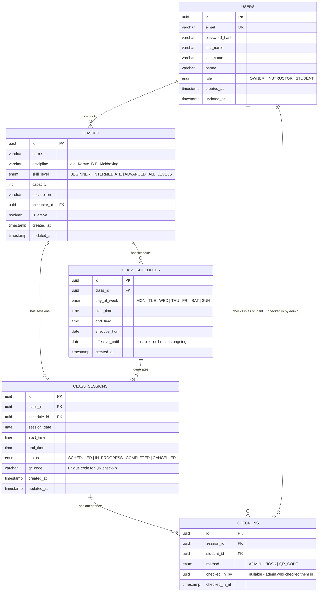

# FlowApp Database Schema

## Entity Relationship Diagram

## Table Descriptions

### USERS
All system users — owners, instructors, and students share one table with a `role` field for role-based access control.

### CLASSES
Defines a class template (e.g., "Monday Night BJJ"). Linked to an instructor and contains metadata like discipline, skill level, and capacity.

### CLASS_SCHEDULES
Recurring schedule definitions. A class can have multiple schedules (e.g., BJJ runs Mon/Wed/Fri at 6pm).

### CLASS_SESSIONS
Individual occurrences of a class. Generated from schedules or created manually. Each session gets a unique QR code for check-in.

### CHECK_INS
Attendance records. Tracks which student checked into which session, when, and how (admin, kiosk, or QR code).
